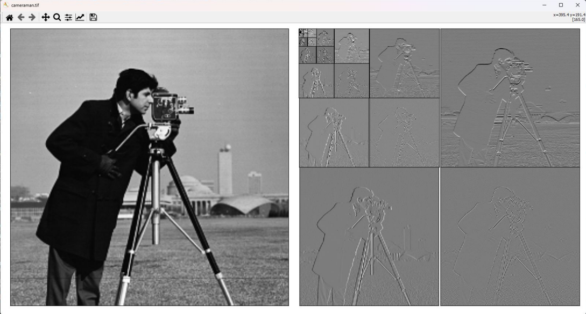

# Adaptive Lifting Scheme

Implementation of a 2D integer lifting scheme that
recursively decomposes the image into the level of individual
pixels. 

In contrast to the ordinary Lifting Scheme, the splitting is based on variance in this case.

